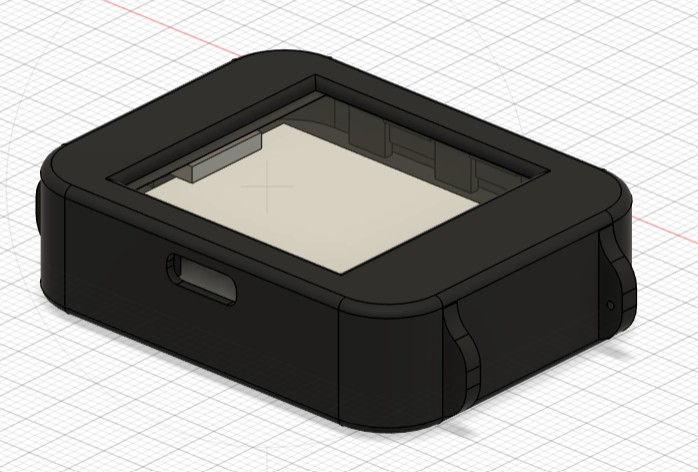
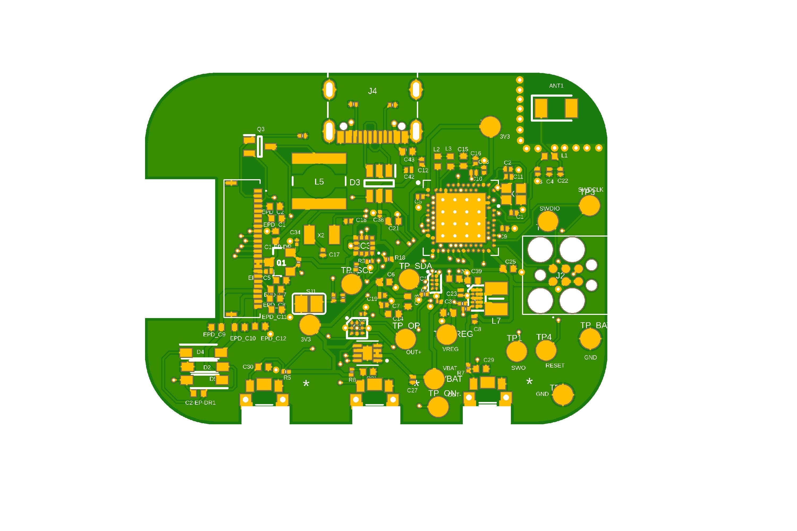
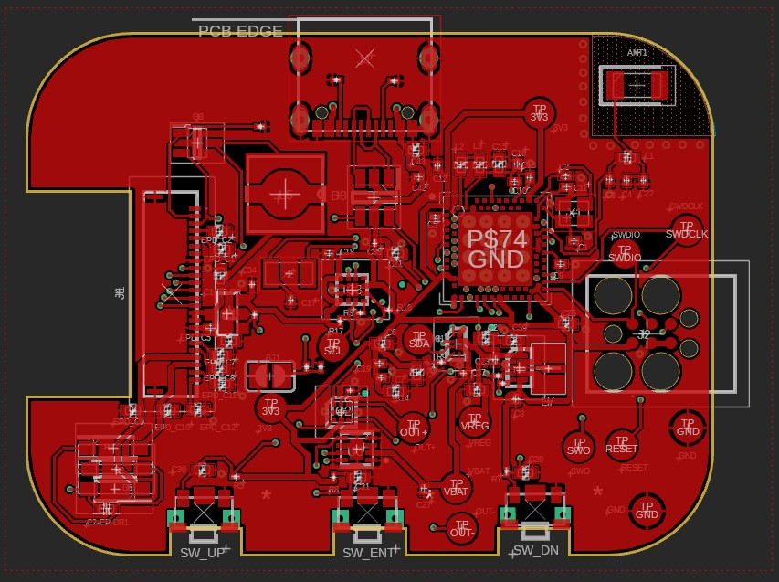
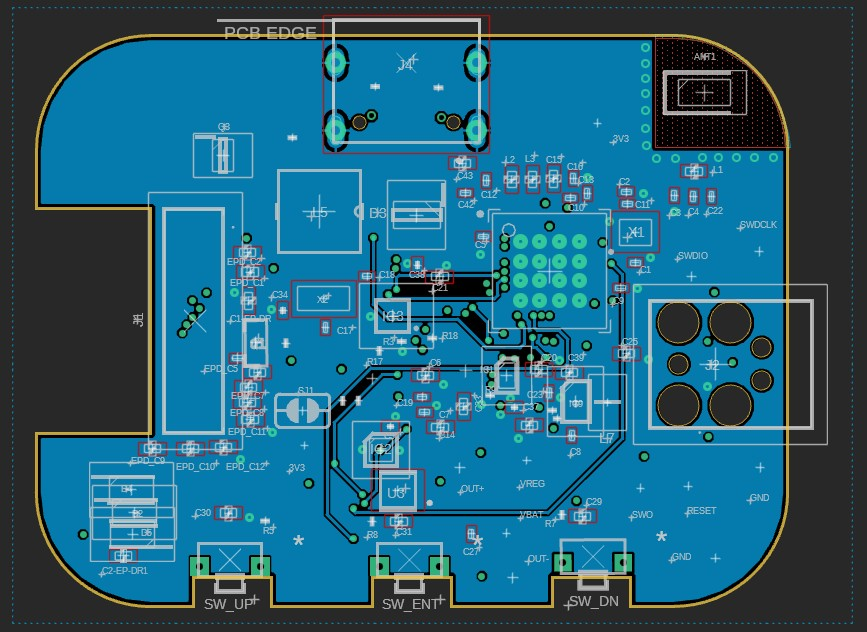
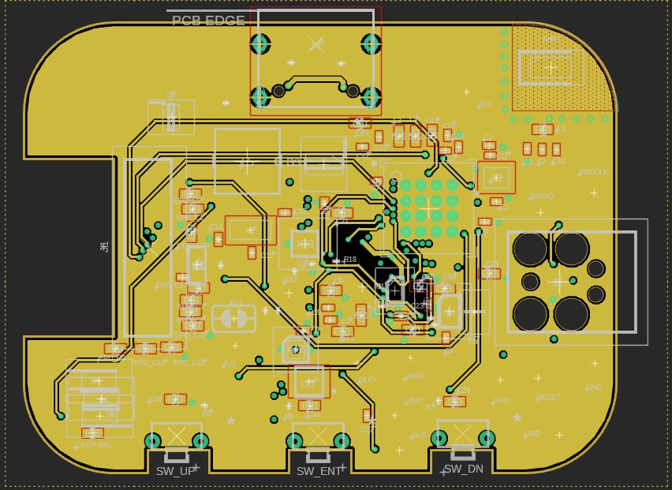
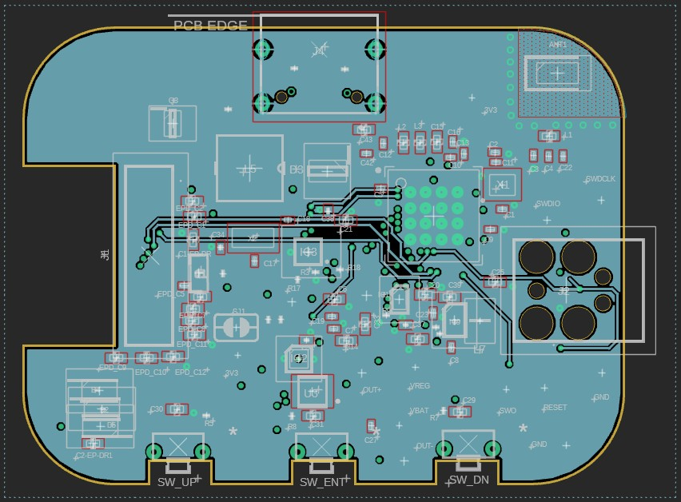
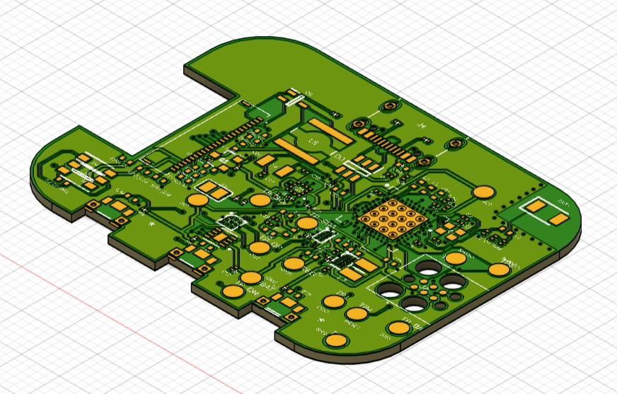
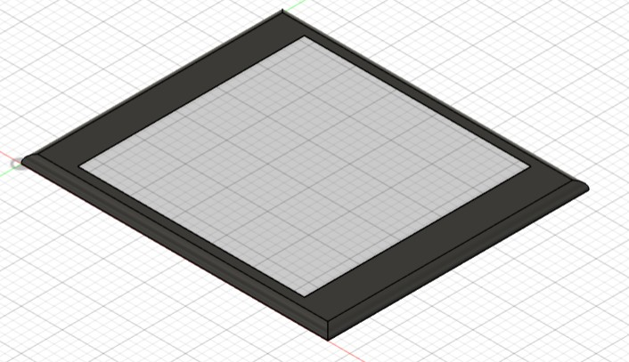
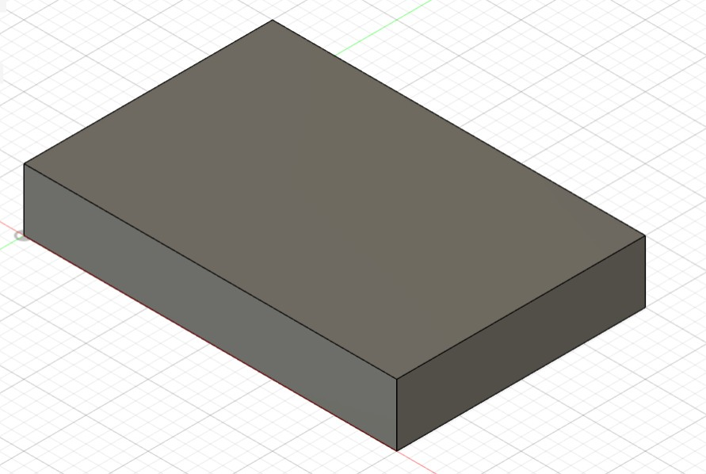
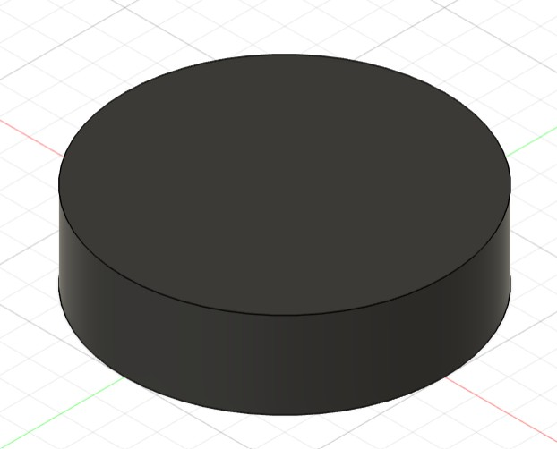

# InkTime Watch

An e-paper smartwatch designed for month-class battery life, sunlight-readable display, and essential phone notifications with basic activity tracking. Built around the **nRF52840** microcontroller with BLE connectivity, a 1.54" e-paper display (200x200), and a power architecture optimized for **30+ days** on a single 250 mAh LiPo charge.



---

## Block Diagram

The diagram below shows all major components and their interconnections:

```
                              ┌──────────────────────────────────────────────────────────┐
                              │                     nRF52840-QIAA                        │
                              │                   (MCU + BLE + USB)                       │
                              │                                                          │
          ┌───────────────────┤  P0.06 (SDA) ──┐                                         │
          │                   │  P0.07 (SCL) ──┤── I2C Bus (10k pull-ups to 3.3V)        │
          │                   │                │                                         │
          │                   │  P0.02 (SCK)   │    ┌─────────────────────┐               │
          │                   │  P0.03 (MOSI)  │    │  1.54" E-Paper      │               │
          │                   │  P0.05 (CS)  ──┼───►│  Display 200x200    │               │
          │                   │  P0.15 (DC)    │    │  (SPI Interface)    │               │
          │                   │  P0.16 (RST)   │    └─────────────────────┘               │
          │                   │  P0.17 (BUSY)  │              ▲                           │
          │                   │                │              │ VEPD                      │
          │                   │  P1.01 ────────┼──► PFET (SI2301CDS) ── VDD_3V3          │
          │                   │                │                                         │
          │                   │  P0.13 (UP)    │    ┌─────────┐                           │
          │                   │  P0.14 (DOWN)──┼────┤ 3 Buttons│ (Active-low, GND)       │
          │                   │  P1.00 (ENT) ──┼────┤ (Panasonic EVP-AKE31A)             │
          │                   │                │    └─────────┘                           │
          │                   │  P0.08 (INT1)  │    ┌──────────────┐                      │
          │                   │  P1.08 (INT2)──┼────┤ BMA421       │                      │
          │                   │                │    │ Accelerometer │ ◄── I2C (0x18)      │
          │                   │                │    └──────────────┘                      │
          │                   │  P0.12 (EN) ───┼───►┌──────────────┐                      │
          │                   │                │    │ DRV2605L     │                      │
          │                   │                │    │ Haptic Driver │ ◄── I2C (0x5A)      │
          │                   │                │    └──────┬───────┘                      │
          │                   │                │           │ OUT+/OUT-                    │
          │                   │                │    ┌──────▼───────┐                      │
          │                   │                │    │ ERM Vibration │                     │
          │                   │                │    │ Motor (LCM1027)│                    │
          │                   │                │    └──────────────┘                      │
          │                   │  P0.10 (ALRT)  │    ┌──────────────┐                      │
          │                   │                ├────┤ MAX17048     │                      │
          │                   │                │    │ Fuel Gauge   │ ◄── I2C (0x36)       │
          │                   │                │    └──────┬───────┘                      │
          │                   │  P0.11 (/INT)  │           │ BAT/VDD                     │
          │                   │                ├───►┌──────▼───────┐                      │
          │                   │                │    │ BQ25180      │ ◄── I2C (0x6A)       │
          │                   │                │    │ Charger/     │                      │
          │                   │                │    │ Power Path   │                      │
          │                   │                │    └──┬───┬───────┘                      │
          │                   │  VBUS ─────────┼───────┘   │ SYS                         │
          │                   │                │    ┌──────▼───────┐                      │
          │                   │                │    │ RT6160       │ ◄── I2C (0x75)       │
          │                   │                │    │ Buck-Boost   │                      │
          │                   │                │    │ → 3.3V Rail  │                      │
          │                   │                │    └──────────────┘                      │
          │                   │                │                                         │
          │                   │  SWDIO/SWDCLK ─┼───► Tag-Connect TC2030 (SWD Debug)      │
          │                   │  D+/D- ────────┼───► USB Type-C (Charging + Data)        │
          │                   │  ANT ──────────┼───► 2.4GHz Chip Antenna (Johanson)      │
          │                   │                │                                         │
          │                   │  XC1/XC2 ──────┼───► 32 MHz Crystal (HFXO)               │
          │                   │  XL1/XL2 ──────┼───► 32.768 kHz Crystal (LFXO)           │
          │                   └────────────────┼─────────────────────────────────────────┘
          │                                    │
          │          ┌─────────────────────────┘
          │          │
    ┌─────▼──────────▼─────────────────────────────┐
    │              Power Tree                       │
    │                                               │
    │  USB 5V → BQ25180 IN → SYS → RT6160 → 3.3V  │
    │  LiPo  → BQ25180 BAT ─┘                      │
    │  LiPo  → MAX17048 (monitoring)                │
    │  3.3V  → PFET → VEPD (switched e-paper rail)  │
    └───────────────────────────────────────────────┘
```

---

## Bill of Materials (BOM)

### Active Components

| Component | Part Number | Package | Function | JLCPCB Part | Datasheet |
|-----------|------------|---------|----------|-------------|-----------|
| MCU | nRF52840-QIAA-R | aQFN73 (7x7) | Microcontroller + BLE + USB | [C190794](https://jlcpcb.com/partdetail/Nordic_Semicon-NRF52840_QIAA_R/C190794) | [Datasheet](https://infocenter.nordicsemi.com/pdf/nRF52840_PS_v1.8.pdf) |
| Charger / Power Path | BQ25180YBGR | DSBGA-8 | Li-Ion/LiPo charger with power path | [C3682423](https://jlcpcb.com/partdetail/TexasInstruments-BQ25180YBGR/C3682423) | [Datasheet](https://www.ti.com/lit/ds/symlink/bq25180.pdf) |
| Buck-Boost Regulator | RT6160AWSC | WLCSP-15 | 3.3V system rail regulator | [C7065276](https://jlcpcb.com/partdetail/Richtek_Tech-RT6160AWSC/C7065276) | [Datasheet](https://www.richtek.com/assets/product_file/RT6160A/DS6160A-05.pdf) |
| Fuel Gauge | MAX17048G+T10 | DFN-8 (2x2) | Battery SOC monitoring | [C2682616](https://jlcpcb.com/partdetail/AnalogDevices-MAX17048G_T10/C2682616) | [Datasheet](https://www.analog.com/media/en/technical-documentation/data-sheets/MAX17048-MAX17049.pdf) |
| Accelerometer | BMA421 | LGA-12 (2x2) | Step counting + motion wake | [C5242966](https://jlcpcb.com/partdetail/Bosch_Sensortec-BMA421/C5242966) | [Datasheet](https://www.bosch-sensortec.com/media/boschsensortec/downloads/datasheets/bst-bma421-ds004.pdf) |
| Haptic Driver | DRV2605LDGSR | VSSOP-10 | ERM motor driver with effects library | [C527464](https://jlcpcb.com/partdetail/TexasInstruments-DRV2605LDGSR/C527464) | [Datasheet](https://www.ti.com/lit/ds/symlink/drv2605l.pdf) |
| Vibration Motor | LCM1027B3605F | Wire leads | ERM haptic feedback motor | [C7528806](https://jlcpcb.com/partdetail/7528806-LCM1027B3605F/C7528806) | [Datasheet](https://datasheet.lcsc.com/lcsc/2310131633_LCM-LCM1027B3605F_C7528806.pdf) |
| PFET (EPD power) | SI2301CDS | SOT-23 | E-paper display power gating | [C10487](https://jlcpcb.com/partdetail/Changjiang_Electronics_Tech_CJ-SI2301CDS/C10487) | [Datasheet](https://www.vishay.com/docs/68749/si2301cds.pdf) |
| USB ESD Protection | USBLC6-2SC6Y | SOT-23-6 | ESD protection on USB data lines | [C7519](https://jlcpcb.com/partdetail/Stmicroelectronics-USBLC6_2SC6Y/C7519) | [Datasheet](https://www.st.com/resource/en/datasheet/usblc6-2.pdf) |

### Connectors & Electromechanical

| Component | Part Number | Package | Function | JLCPCB Part | Datasheet |
|-----------|------------|---------|----------|-------------|-----------|
| FPC Connector (Display) | Molex 503480-2400 | 24-pin 0.5mm FPC | E-paper display FPC connection | [C2857160](https://jlcpcb.com/partdetail/Molex-5034802400/C2857160) | [Datasheet](https://www.molex.com/en-us/products/part-detail/5034802400) |
| USB Type-C Connector | KH-TYPE-C-16P | 16-pin SMD | USB charging + data | [C2765186](https://jlcpcb.com/partdetail/Kinghelm-KH_TYPE_C_16P/C2765186) | [Datasheet](https://datasheet.lcsc.com/lcsc/2012121836_Kinghelm-KH-TYPE-C-16P_C2765186.pdf) |
| Buttons (x3) | EVP-AKE31A | SMD tactile | Up / Down / Enter navigation | [C2845028](https://jlcpcb.com/partdetail/Panasonic-EVP_AKE31A/C2845028) | [Datasheet](https://industrial.panasonic.com/cdbs/www-data/pdf/ATV0000/ATV0000CE3.pdf) |
| SWD Debug Header | TC2030-IDC | Tag-Connect 6-pin | SWD programming + debug | -- (footprint only) | [Info](https://www.tag-connect.com/product/tc2030-idc) |
| Antenna | 2450AT18B100E | SMD 3216 | 2.4 GHz BLE chip antenna | [C5179427](https://jlcpcb.com/partdetail/Johanson_Technology-2450AT18B100E/C5179427) | [Datasheet](https://www.johansontechnology.com/datasheets/2450AT18B100/2450AT18B100.pdf) |

### Passive Components (Key)

| Component | Value | Package | Qty | Function |
|-----------|-------|---------|-----|----------|
| Capacitors (decoupling) | 100nF | 0201 | 5 | MCU + peripheral decoupling |
| Capacitors (crystal load) | 12pF | 0201 | 4 | 32MHz + 32.768kHz crystal loads |
| Capacitors (bulk) | 4.7uF | 0402 | 4 | MCU power rail bulk decoupling |
| Capacitors (USB) | 4.7uF | 0402 | 1 | DECUSB capacitor |
| Capacitors (power) | 22uF | 0402 | 2 | RT6160 input capacitors |
| Capacitors (charger) | 1uF | 0402 | 3 | BQ25180 CIN/CSYS/CBAT |
| Capacitors (EPD) | 1uF/50V | 0402 | 9 | E-paper driver capacitors |
| Inductor (DC/DC) | 10uH | 0402 | 1 | nRF52840 REG1 DC/DC inductor |
| Inductor (buck-boost) | 0.47uH | 2012 | 1 | RT6160 power stage inductor |
| Resistors (I2C pull-up) | 10k | 0201 | 2 | I2C SDA/SCL pull-ups |
| Resistors (USB CC) | 5.1k | 0201 | 2 | USB Type-C CC1/CC2 pull-downs |
| Crystals | 32 MHz | 2016 | 1 | HFXO for MCU + radio |
| Crystals | 32.768 kHz | 3215 | 1 | LFXO for RTC timekeeping |

### Hand-Assembled Components

| Component | Description |
|-----------|-------------|
| E-Paper Display | 1.54" 200x200 e-paper panel (connected via 24-pin FPC) |
| LiPo Battery | 250 mAh lithium polymer cell |
| ERM Motor | Vibration motor (LCM1027B3605F, wire-soldered) |
| Enclosure | 3D-printed case (SLS/MJF or FDM prototype) |

---

## Hardware Functionality - Detailed Description

### 1. Microcontroller - nRF52840-QIAA

The **nRF52840** is a multi-protocol SoC featuring a 64 MHz Arm Cortex-M4F processor with 1 MB Flash and 256 KB RAM. It provides:
- **Bluetooth Low Energy 5.0** for phone notifications and time sync
- **Native USB 2.0** for charging detection and debug/DFU
- **Normal-voltage DC/DC converter** (REG1) enabled at runtime to reduce power consumption, using an external 10uH inductor on DCC/DEC4
- **Low-power RTC** driven by the 32.768 kHz LFXO crystal for accurate timekeeping and minute-tick wake events

The MCU requires:
- External **32 MHz crystal** (HFXO) between XC1/XC2 with 12pF load capacitors for radio operation
- External **32.768 kHz crystal** (LFXO) between XL1/XL2 with 12pF load capacitors for the RTC
- **DECUSB** capacitor (4.7uF) for USB functionality
- DEC1 (100nF), DEC4+DEC6 (1uF) decoupling capacitors for internal regulators

### 2. Power Architecture

The power system is designed around a power-path topology that allows seamless operation from USB or battery:

```
USB 5V ──► BQ25180 IN ──► SYS ──► RT6160 VIN ──► 3.3V Rail (all peripherals)
LiPo   ──► BQ25180 BAT ──┘
LiPo   ──► MAX17048 BAT/VDD (fuel gauge monitoring)
3.3V   ──► PFET gate (P1.01) ──► VEPD (switched e-paper supply)
```

**BQ25180 (Charger / Power Path)** - I2C address 0x6A
- Single-cell Li-Ion/LiPo charger with integrated power-path management
- IN pin receives USB 5V; BAT connects to LiPo; SYS provides regulated output to RT6160
- `/INT` output (P0.11) signals charge status changes (USB attach/detach, charge complete)
- TS/MR strapped with 10k to GND (temperature sensing disabled for Rev A simplicity)
- Decoupling: CIN 1uF, CSYS 10uF, CBAT 1uF

**RT6160 (Buck-Boost Regulator)** - I2C address 0x75
- Provides a stable **3.3V output** across the full battery discharge range (3.0V-4.2V) via buck-boost topology
- VSEL tied low for default 3.3V output
- EN tied to VSYS (always on when system power is present)
- I2C connected for optional telemetry and future DVFS capability
- Power stage: 0.47uH inductor (FTC252012SR47MBCA), 2x 22uF input caps, 10uF output cap

**MAX17048 (Fuel Gauge)** - I2C address 0x36
- ModelGauge algorithm for accurate battery state-of-charge without current-sense resistor
- Connected directly to VBAT for voltage monitoring
- ALRT pin (P0.10) generates interrupt at configurable low-battery threshold
- Ultra-low quiescent current (~3uA) for minimal battery drain

### 3. E-Paper Display (1.54" 200x200)

The display connects via a **24-pin FPC** (Molex 503480-2400) and communicates over **SPI**:
- **Partial refresh** once per minute for the digital clock face (low power, minimal flicker)
- **Full refresh** periodically to clear ghosting artifacts
- **Power gating** via a P-channel MOSFET (SI2301CDS) controlled by P1.01, with a 100k pull-up to default OFF at reset. This ensures the display is fully powered down between updates to minimize leakage current
- Optional DNP series resistors on SPI lines prevent back-powering through the display when VEPD is off

The firmware update sequence: assert bus low/Hi-Z -> enable VEPD -> wait for stabilization -> toggle RST -> init panel -> update framebuffer -> optionally disable VEPD.

### 4. Accelerometer - BMA421

The **BMA421** is a triaxial low-g accelerometer with an **embedded step counter** (pedometer):
- Connected via **I2C** (address 0x18, SDO strapped low, CSB strapped high)
- **INT1** (P0.08): primary wake interrupt for step events and motion detection
- **INT2** (P1.08): secondary interrupt for advanced gesture/event detection (future use)
- The embedded step counter runs autonomously, requiring only periodic readout from the MCU
- In low-power mode, the sensor runs the step counter with minimal current draw while the MCU sleeps
- VDD and VDDIO both connected to 3.3V with 100nF decoupling each

### 5. Haptic Feedback - DRV2605L + ERM Motor

The **DRV2605L** is a haptic driver with a built-in effects library (~120 waveforms):
- Connected via **I2C** (address 0x5A) for effect selection and configuration
- **EN** pin (P0.12) allows complete shutdown between haptic events to eliminate standby current
- Drives the **LCM1027B3605F** ERM (Eccentric Rotating Mass) vibration motor
- Haptic patterns used for: notification alerts, low-battery warnings, and optional button feedback
- The built-in Smart Loop Architecture automatically adjusts drive signals based on motor feedback

### 6. User Input - Three Buttons

Three **Panasonic EVP-AKE31A** tactile switches provide navigation:
- **Up** (P0.13): scroll up / increment
- **Down** (P0.14): scroll down / decrement
- **Enter/Esc** (P1.00): select (short press) / back (long press)
- All wired active-low to GND with internal MCU pull-ups enabled
- All three buttons serve as wake sources from deep sleep via GPIO SENSE

### 7. USB Type-C

A **USB Type-C** connector (KH-TYPE-C-16P) provides:
- **Charging**: 5V input to BQ25180 for LiPo charging
- **Data**: USB 2.0 via nRF52840 native USB (D+/D- routed as differential pair)
- **ESD protection**: USBLC6-2SC6Y TVS diode array on D+/D- and VBUS
- **CC pull-downs**: 5.1k resistors on CC1/CC2 for proper USB-C device detection
- VBUS also connected to nRF52840 for USB attach detection

### 8. Debug / Programming - Tag-Connect TC2030

The **Tag-Connect TC2030-IDC** pogo-pin footprint provides a pads-only SWD interface:
- Pin 1: VTref (3.3V) - debugger voltage reference
- Pin 2: SWDIO
- Pin 3: GND
- Pin 4: SWDCLK
- Pin 5: GND
- Pin 6: nRESET

This enables factory programming, firmware updates, and field recovery without a permanently soldered header, saving PCB space.

### 9. RF / Antenna

A **Johanson 2450AT18B100E** chip antenna with a Nordic-recommended matching network (3.9nH inductor + 820pF/1pF capacitors) handles BLE communication at 2.4 GHz. The PCB layout follows Nordic's reference design with a dedicated ground plane and keepout zone under the antenna.

---

## Pin Assignment Table

| nRF52840 Pin | Function | Connected To | Reason |
|-------------|----------|-------------|--------|
| **P0.02** | SPI SCK | E-Paper Display | SPI clock for display communication |
| **P0.03** | SPI MOSI | E-Paper Display | SPI data out to display controller |
| **P0.05** | SPI CS | E-Paper Display | Chip select for display SPI bus |
| **P0.06** | I2C SDA | Shared I2C Bus | Data line for all I2C peripherals (BMA421, MAX17048, DRV2605L, BQ25180, RT6160) |
| **P0.07** | I2C SCL | Shared I2C Bus | Clock line for all I2C peripherals |
| **P0.08** | GPIO Input (INT) | BMA421 INT1 | Primary accelerometer interrupt for step events and motion wake |
| **P0.10** | GPIO Input (INT) | MAX17048 ALRT | Low-battery alert interrupt (active low) |
| **P0.11** | GPIO Input (INT) | BQ25180 /INT | Charger status interrupt (USB attach/detach, charge complete) |
| **P0.12** | GPIO Output | DRV2605L EN | Haptic driver enable/shutdown control |
| **P0.13** | GPIO Input (BTN) | Button Up | User navigation - scroll up (active low, internal pull-up) |
| **P0.14** | GPIO Input (BTN) | Button Down | User navigation - scroll down (active low, internal pull-up) |
| **P0.15** | GPIO Output | E-Paper DC | Data/Command select for e-paper SPI |
| **P0.16** | GPIO Output | E-Paper RST | Hardware reset for e-paper controller |
| **P0.17** | GPIO Input | E-Paper BUSY | Display busy status (polled before sending commands) |
| **P1.00** | GPIO Input (BTN) | Button Enter/Esc | User navigation - select/back (active low, internal pull-up) |
| **P1.01** | GPIO Output | PFET Gate | E-paper power gating control (low = ON, high/float = OFF) |
| **P1.08** | GPIO Input (INT) | BMA421 INT2 | Secondary accelerometer interrupt (advanced events, future use) |
| **XC1/XC2** | HFXO | 32 MHz Crystal | Required for BLE radio operation |
| **XL1/XL2** | LFXO | 32.768 kHz Crystal | RTC timekeeping for accurate minute-tick scheduling |
| **D+/D-** | USB | USB Type-C | Native USB 2.0 for charging detection and data |
| **VBUS** | USB detect | USB Type-C 5V | USB attach/detach detection |
| **SWDIO** | Debug | TC2030 Pin 2 | SWD programming and debug |
| **SWDCLK** | Debug | TC2030 Pin 4 | SWD programming clock |
| **nRESET** | Reset | TC2030 Pin 6 | Hardware reset (active low) |
| **ANT** | RF Output | Matching Network | 2.4 GHz BLE antenna output |
| **DCC** | DC/DC | 10uH Inductor | REG1 buck converter output for power efficiency |

### Pin Assignment Rationale

- **I2C on P0.06/P0.07**: These pins support the nRF52840's TWIM peripheral with EasyDMA, enabling efficient multi-device communication on a single shared bus (5 devices, all with unique addresses).
- **SPI on P0.02/P0.03/P0.05**: Grouped on Port 0 low pins for clean routing to the display FPC connector on the PCB. SPI is used instead of I2C for the display due to the higher data throughput needed for framebuffer transfers.
- **Buttons on P0.13/P0.14/P1.00**: All support GPIO SENSE for wake-from-sleep, enabling the MCU to remain in deep sleep until a button press occurs. Placed on pins routed to the bottom PCB edge where the tactile switches are physically located.
- **Interrupts on P0.08/P0.10/P0.11/P1.08**: Each interrupt source gets a dedicated GPIO to allow the firmware to immediately identify the wake source without polling, minimizing active time.
- **PFET gate on P1.01**: Port 1 pin chosen to keep it separate from the SPI and I2C signal groups, reducing routing congestion. The 100k pull-up ensures the PFET defaults OFF at reset, preventing the display from powering on in an undefined state.
- **DRV2605L EN on P0.12**: Close to the I2C pins for compact routing of the haptic driver section.

---

## Energy Consumption Estimate

### Power Budget (Typical Usage Profile)

The target is **30+ days** on a **250 mAh** LiPo battery. The typical usage profile assumes:
- Display partial refresh once per minute
- 50 BLE notifications per day with haptic alerts
- Always-on step counting via BMA421
- BLE advertising/connection maintenance

| State / Event | Current Draw | Duty Cycle | Average Current |
|--------------|-------------|------------|-----------------|
| **Deep Sleep** (MCU System OFF, RTC running) | ~1.5 uA | ~98.5% | ~1.48 uA |
| **RTC Wake + Partial Refresh** (1/min) | ~5 mA | ~200ms/60s = 0.33% | ~16.7 uA |
| **BLE Advertising** (low duty) | ~0.2 mA avg | ~1% | ~2.0 uA |
| **BLE Connection Event** (50 notifs/day) | ~8 mA | ~50ms x 50 / 86400s = 0.003% | ~0.23 uA |
| **Haptic Pulse** (50/day, 200ms each) | ~150 mA | ~10s / 86400s = 0.012% | ~17.4 uA |
| **BMA421 Step Counter** (always-on) | ~14 uA | 100% | ~14.0 uA |
| **MAX17048 Fuel Gauge** | ~3 uA | 100% | ~3.0 uA |
| **Quiescent (BQ25180 + RT6160)** | ~5 uA | 100% | ~5.0 uA |
| **Full Refresh** (1/hour) | ~15 mA | ~1s/3600s = 0.028% | ~4.2 uA |
| **Leakage + misc** | -- | -- | ~5.0 uA |
| | | **Total Average** | **~69 uA** |

**Estimated Battery Life**: 250 mAh / 0.069 mA = **~3,623 hours = ~151 days**

> **Note**: This is a theoretical estimate under ideal conditions. Real-world factors (battery self-discharge, temperature, connection frequency, notification volume) will reduce this. The conservative engineering target of 30+ days includes significant margin for these factors.

---

## PCB Design

### Layout

- **4-layer stackup**: Signal - GND - Power - Signal, optimized for RF performance and power integrity
- Dedicated ground plane under the RF section with antenna keepout zone
- Charger and regulator placed away from the antenna area
- Accelerometer physically separated from the vibration motor to minimize false motion coupling
- Tag-Connect TC2030 footprint accessible at the PCB edge
- USB differential pair routed with matched lengths
- 14 test pads provided for: VBAT, VSYS, VDD_3V3, VEPD, GND, I2C (SDA/SCL), and key signals

### PCB Renders

**Board Overview**



**2D Layout - Top Layer**



**2D Layout - Bottom Layer**



**2D Layout - Inner Layer 2 (Route2)**



**2D Layout - Inner Layer 63 (Route63)**



**3D Render**



---

## Mechanical Design

The enclosure is designed in Fusion 360 and prototyped via 3D printing (SLS/MJF).

**Layer stack**: Top lens -> E-paper display module -> PCB -> LiPo battery -> ERM motor -> Back cover


### Component Models

| Component | 3D Model |
|-----------|----------|
| E-Paper Display |  |
| LiPo Battery (250 mAh) |  |
| ERM Vibration Motor |  |

### Mechanical Files

- [InkTime_Watch.f3z](Mechanical/InkTime_Watch.f3z) - Fusion 360 archive
- [InkTime_Watch.step](Mechanical/InkTime_Watch.step) - STEP file for CAD import

---

## Schematic

The Eagle schematic and board files are available in the [Hardware/](Hardware/) folder:
- [InkTime_Schematic.sch](Hardware/InkTime_Schematic.sch) - Eagle schematic
- [InkTime_Schematic.brd](Hardware/InkTime_Schematic.brd) - Eagle board layout

---

## Manufacturing

Manufacturing files ready for JLCPCB assembly are in the [Manufacturing/](Manufacturing/) folder:
- [gerbers.zip](Manufacturing/gerbers.zip) - Gerber files for PCB fabrication
- [InkTime_Schematic.csv](Manufacturing/InkTime_Schematic.csv) - Full BOM for assembly
- [PnP_InkTime_Schematic_front.csv](Manufacturing/PnP_InkTime_Schematic_front.csv) - Pick and Place file

**Hand-assembled components** (not in SMT BOM): e-paper display (FPC), LiPo battery, ERM vibration motor, enclosure assembly.

---

## Project Structure

```
InkTime_Watch/
├── Hardware/                  # Eagle schematic and board files
│   ├── InkTime_Schematic.sch
│   └── InkTime_Schematic.brd
├── Images/                    # Renders, photos, and diagrams
│   ├── InkTime_Watch.jpg      # Enclosure 3D render
│   ├── InkTime_Board.jpg      # Board overview render
│   ├── pcb_2d_top.jpg         # PCB 2D layout - top layer
│   ├── pcb_2d_bottom.jpg      # PCB 2D layout - bottom layer
│   ├── pcb_2d_route2.jpg      # PCB 2D layout - inner layer 2
│   ├── pcb_2d_route63.jpg     # PCB 2D layout - inner layer 63
│   ├── pcb_3d.jpg             # PCB 3D render
│   ├── battery.jpg            # Battery 3D model
│   ├── display.jpg            # Display 3D model
│   └── motor.jpg              # Motor 3D model
├── Manufacturing/             # Production files for JLCPCB
│   ├── gerbers.zip
│   ├── InkTime_Schematic.csv  # BOM
│   └── PnP_InkTime_Schematic_front.csv
├── Mechanical/                # CAD files for enclosure
│   ├── InkTime_Watch.f3z      # Fusion 360 archive
│   └── InkTime_Watch.step     # STEP export
├── LICENSE                    # MIT License
└── README.md
```
